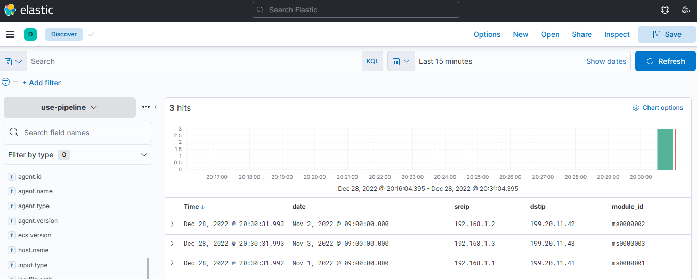
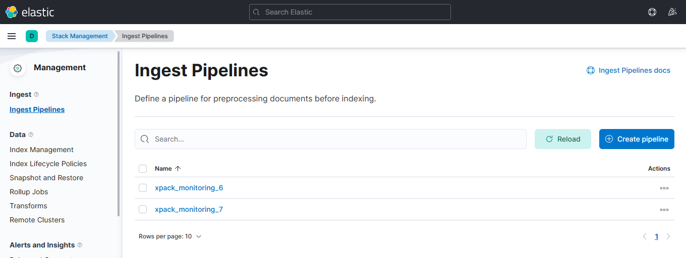
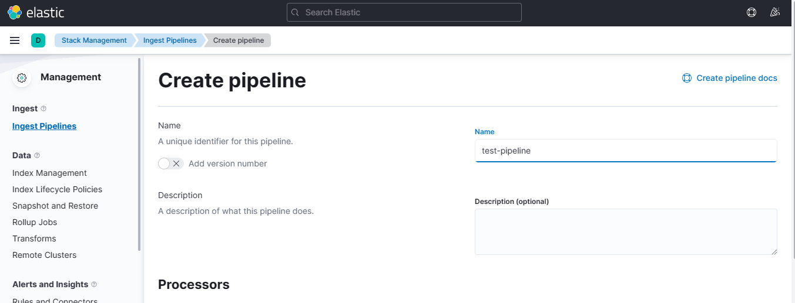
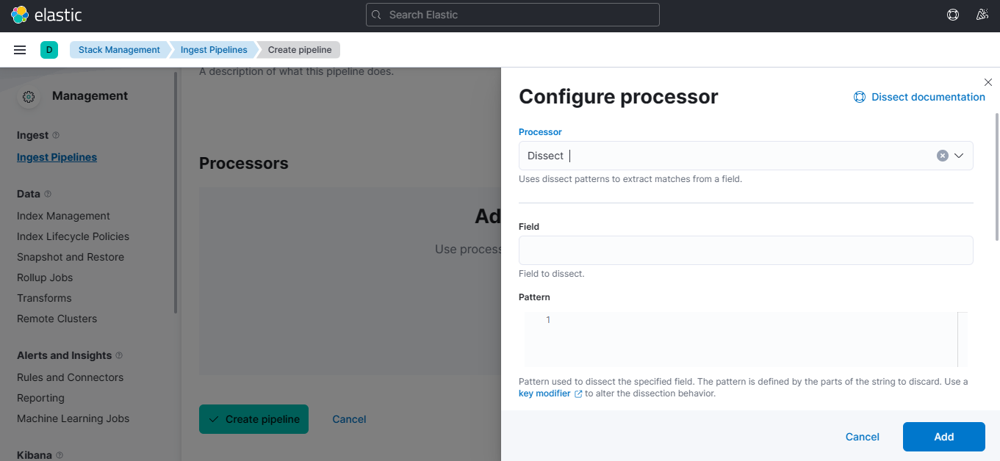
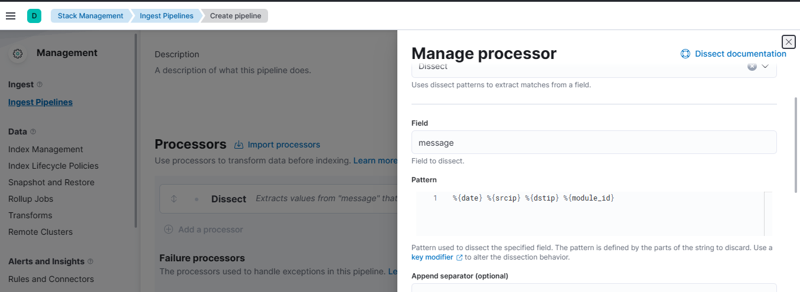
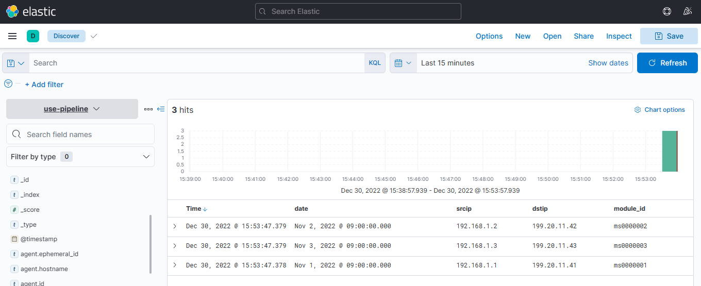
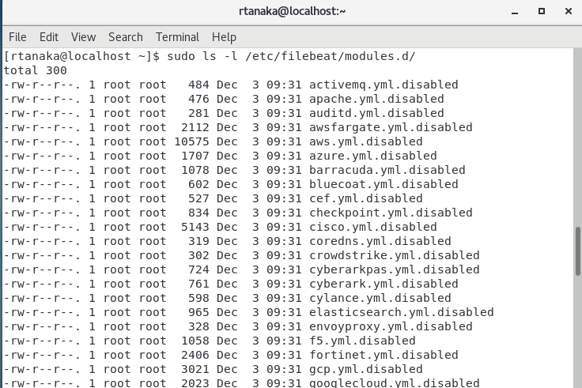
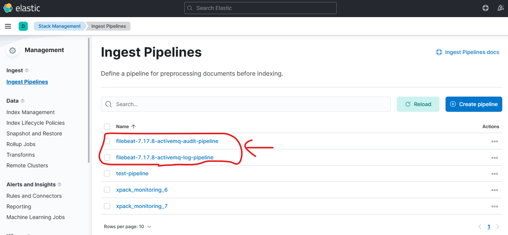
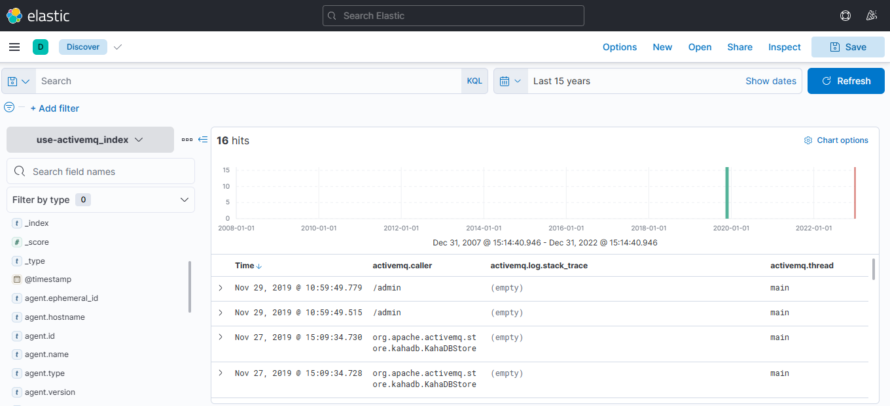

# Filebeatの使いかた(2章)  

[1章](https://github.com/RyuTanak/How-To-Filebeat-1)では、データ取得、データ送信についてやりました。  
2章では、データ加工の方法について説明します。  

## 目次  
[データ加工について](#content1)  
[filebeatのprocessorを使ったデータ加工方法](#content2)  
[ElasticsearchのIngest pipelineを使ったデータ加工方法](#content3)  
[filebeat moduleを使ったデータ加工方法](#content4)  

<h2 id="content1">データ加工について</h2>  

データ加工とは言っても、何をどうやって加工するのかについて説明します。  
まず、「何を」とはログデータのことです。（1章でも説明）  
機器から出ているログ、例えば  
```  
2022-11-01 12:00:00 192.168.1.1 199.20.11.44 ms0000000  
2022-11-02 12:00:00 192.168.1.1 199.20.11.44 ms0000000  
・
・
・
```  
のようなデータのことです。  

「どうやって加工する」については、前提としてElasticsearchのindexにログデータを登録するとして  

|Field名|datetime|srcip|dstip|module_id|  
|-|-|-|-|-|  
|データ1|2022-11-01 12:00:00|192.168.1.1|199.20.11.44|ms0000000|  
|データ2|2022-11-02 12:00:00|192.168.1.1|199.20.11.44|ms0000000|  

のように空白で区切られている各項目に、Field名を付与することをします。  

Filebeatでは、様々な方法でデータ加工を行うことが出来ます。  
業務で得た知識から、知っているデータ加工方法を紹介していきます。  


<h2 id="content2">filebeatのprocessorを使ったデータ加工方法</h2>  

リファレンスは以下を参照  
https://www.elastic.co/guide/en/beats/filebeat/7.17/filtering-and-enhancing-data.html  

以下のログを加工してみる  
```  
2022-11-01 192.168.1.1 199.20.11.41 ms0000001  
2022-11-02 192.168.1.2 199.20.11.42 ms0000002  
2022-11-03 192.168.1.3 199.20.11.43 ms0000003  
```

filebeat.ymlに上記のprocessorを定義することでデータ加工を行うことができる。  
今回は「dissect」というprocessorを使用する。  
filebeat.ymlを以下のように定義する。  

```yaml
filebeat.inputs:
- type: log
  enabled: true
  paths:
    - /var/log/test/*.log
setup.template.name: "tokyo"
setup.template.pattern: "tokyo-*"
setup.ilm.enabled: false
output.elasticsearch:
  hosts: ["localhost:9200"]
  username: "filebeat_writer"
  password: "YOUR_PASSWORD"
  index: "use-pipeline"
processors:
  - dissect:
      tokenizer: '%{date} %{srcip} %{dstip} %{module_id}'
      field: "message"
      target_prefix: ""
```

indexのデータを見ると、ログの各項目にField名がついて登録されていることが分かる。  
  

このようにログを加工することができる。  
どのprocessorを使うかは、入力されるログによって適切なモノを使うとよい。  

<h2 id="content3">ElasticsearchのIngest pipelineを使ったデータ加工方法</h2>  

先ほどはFilebeatの機能を用いて、ログの加工を行った。  
次はElasticsearchの機能を使ってログを加工する。  

ElasticsearchのIngest Pipelineを使用する。  
kibanaの画面から「stack management」→「Ingest Pipelines」を選択する。  
  

「Create pipeline」を選択し、「Name」にtest-pipelineと入力  
  
 
「Add a processor」を選択し、「processor」の中からdissectを選択する。  
  

「field」欄にmessage、「Pattern」欄に %{date} %{srcip} %{dstip} %{module_id}を入力し、右下の「Add」を押す。  
  

最後に左下の「create pipeline」を押す。これでElasticsearch側の設定は完了。  

次にFilebeatの設定で、filebeat.ymlを以下の設定にする。  
```yaml
filebeat.inputs:
- type: log
  enabled: true
  paths:
    - /var/log/test/*.log
setup.template.name: "tokyo"
setup.template.pattern: "tokyo-*"
setup.ilm.enabled: false
output.elasticsearch:
  hosts: ["localhost:9200"]
  username: "filebeat_writer"
  password: "YOUR_PASSWORD"
  index: "use-pipeline"
  pipeline: "test-pipeline"
```

filebeatを起動し、ログを配置すると  
indexのデータを見ると、ログの各項目にField名がついて登録されていることが分かる。  
  

このようにpipelineは自作することができるため、用途に応じて  
pipelineを生成することができる。  

<h2 id="content4">filebeat moduleを使ったデータ加工方法</h2>  

実際に機器のログを分解しようと、上記で紹介した方法で行う場合  
様々なprocessorを使ってどう分解しないといけないかを考えなくてはいけないが  
Filebeatには特定の機器のログに対してはすでにprocessorやpipelineを実装している。  
以下のリファレンスにあるのは、Filebeatが対応済みの機器の一覧である。  
https://www.elastic.co/guide/en/beats/filebeat/7.17/filebeat-modules.html  

ここでは「activemq」というmoduleを対象に、実際に利用してみます。  

/var/filebeat/modules.dフォルダ下のファイルを見ると  
「activemq.yml.disable」というファイルがあるので、「activemq.yml」にファイル名を変更する  
  

/var/filebeat/modules.d/activemq.ymlを以下のように変更する。  
```yaml
# Module: activemq
# Docs: https://www.elastic.co/guide/en/beats/filebeat/7.17/filebeat-module-activemq.html

- module: activemq
  # Audit logs
  audit:
    enabled: true

    # Set custom paths for the log files. If left empty,
    # Filebeat will choose the paths depending on your OS.
    #var.paths:

  # Application logs
  log:
    enabled: true

    # Set custom paths for the log files. If left empty,
    # Filebeat will choose the paths depending on your OS.
    var.paths:                  #←コメントを外す
      - /var/log/test/*.log     #←この1行を追加

```

filebeat.ymlを以下のように編集する。  
```yaml
filebeat.inputs:
filebeat.config.modules:                #←追加
  path: ${path.config}/modules.d/*.yml  #←追加
setup.template.name: "tokyo"
setup.template.pattern: "tokyo-*"
setup.ilm.enabled: false
#logging.level: debug
#logging.to_files: true
#logging.files:
#  path: /var/log/filebeat
#  name: test
#  keepfiles: 7
#  permissions: 0644
output.elasticsearch:
  hosts: ["localhost:9200"]
  username: "filebeat_writer"
  password: "YOUR_PASSWORD"
  index: "use-activemq_index"
```

次のコマンドを実行する。  
```
sudo filebeat setup --pipelines
```
このコマンドを実行するとIngest Pipelinesに2つのpipelineが追加される。  
  

あとは、filebeatを起動してログを置くだけであるが  
ログは以下のURLのログを使う。(activemqが出力するログが参考としてGithubに上がっている)  
https://github.com/elastic/beats/blob/main/x-pack/filebeat/module/activemq/log/test/activemq.log  

indexを見ると、ログが分解されたデータがindexに登録されている。  
  

※右上の「show data」の時間範囲を変更しないと、入力したデータが出てこないので注意。  


